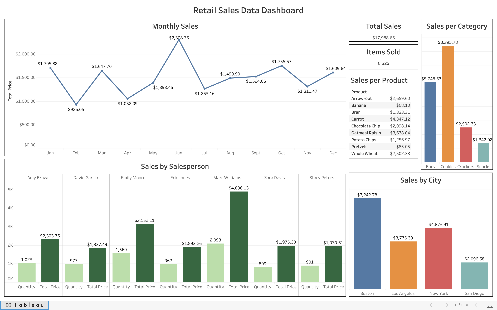

# Retail Sales Dashboard

You can find the Dasboard [HERE](https://public.tableau.com/app/profile/vaiebhav.chettri/viz/RetailSales_16930599137140/RetailSalesDataDashboard).

This Dashboard was designed for analyzing Retail Sales Data provided in an Excel Sheet. I attempted to inquire about various aspects, such as:

1. The aggregate sales value.
2. The quantity of items sold.
3. The top-performing salesperson.
4. The least successful salesperson.
5. The city with the most substantial sales.
6. The category and specific product that achieved the highest sales.
7. The month with the peak sales.
8. The monthly fluctuations in sales performance.

From my investigations, I've gathered the following findings:

1. The cumulative sales amounted to $17,988.86 from the sale of 8,325 units.
2. Marc Williams emerged as the top achiever among salespeople, amassing $4,896.13 through the sale of 2,093 items.
3. On the other hand, David Garcia struggled as the least successful salesperson, generating $1,837.49 from 977 items sold.
4. The city that stood out in terms of sales was Boston, bringing in a substantial $7,242.78.
5. Among various categories and products, Arrowroot cookies led the way in generating the highest sales.
6. Sales reached their zenith in June, while February experienced the most significant decline in sales performance.
